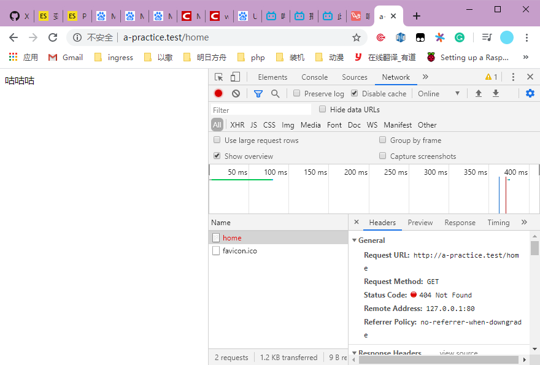

# laravel的一点理解...?

第一次接触MVC这个概念是2018-2019年后端组的授课，当时好像以zlb从SpeedPHP改写的FlashPHP举得例子，然后当时的我也并不知道SpeedPHP是什么，并且现在依旧不知道。

所谓的MVC，百度一下有很多的blog和什么什么的，甚至百度百科也有这个词条，是一个软件设计模式，然而当时的我看的再多也并没有多么深刻的理解，所以说抛开实践谈理解是有点困难的说。

然后在寒假参与的寒假项目一个人怼完了一个项目之后倒是对这个有了比较深刻的了解，当时的我就是用FlashPHP做的那个项目，还记得当时分任务的时候有分具体的这个功能，前端我做，后端你做。然而后来觉得再不约定好怎么传值的情况下还不如一个人负责一整个功能(x

所谓的MVC就是Model-View-Controller 模型-视图-控制器，然而没有实践过的话要明白这个有点困难，所以就先不对每个名词进行解释。

在用户的浏览器对服务器发起访问的过程中，就是浏览器向服务器发送了一个请求的数据包，然后服务器收到这个请求数据包之后整理好用户需要的东西包在响应数据包里边返回给用户，然后浏览器解析响应数据包展现给用户看他想看的东西。

上面这段话描述的其实就是一个完整的http请求过程。只是省略了在服务器发生的事情和在浏览器发生的事情，然后这篇文章主要涉及到的会是在服务器发生的那些事。

以laravel为例，过程大概是这样的

#### 路由

服务器接收到一个请求

这个请求的url(也就是链接)假如是

```
https://acm.njupt.edu.cn/contest/120?parm=eheihei
```

在上面的这个链接里面可以理解成包含四个部分，这么看这个url，

`https://`  `acm.njupt.edu.cn`  `[:443]`  `/contest/120`  `?parm=eheihei`

有四个部分，它们分别是

- 协议 `https://`
  - 告诉服务器使用的是什么协议，
  - 常见的基本就http和https
  - 这个可以不加理会
- 域名 `acm.njupt.edu.cn`
  - 在网络上的计算机都会有一个ip地址作为让别人找到他的依据
  - 这个域名可以理解成ip地址的助记符，毕竟ip地址一串数字怪难记的
  - 其实这个也不需要多么理会
- 端口 `[:443]  `
  - 一般http协议通过80端口，然后https协议通过443端口
  - 然后这个端口一般是可以省略的，所以我们也不需要理会
- 路径 `/contest/120`
  - 前面三个都不需要理会而我又专门提了url这个概念就意味着后面的这个东西比较重要了
  - 在没有url重写的站点上经常可以见到访问/index.html这种操作
  - 实际上就是浏览器告诉服务器说我希望浏览服务器上根目录的index.html这个文件
  - 然后服务器看到这个文件有，你权限也够，噢那我就直接给你了，这也是一个响应
  - 当然这是一种处理方式，对于这种可以直接给用户的比如html文件，但是有一些是不能直接给用户看的呢，比如说index.php，这个时候服务器就会把他丢给对应的应用服务器，比如php一般丢给php-fpm
  - 然后这个应用服务器处理完之后吧index.php变成一个html丢回给主服务器然后服务器再丢回给用户
  - 其实前面的5个白点点都是突然想起来然后就打出来了(x
  - 在laravel里面，这一个部分会被作为依据由路由把请求解析到一个控制器上，还是后面再说好了
- 查询串
  - 众所周知，四大天王一般有五个，所以四个部分应该有五个黑点
  - 虽然大家一般把这个部分放到路径里边，但是我觉得还是分开来比较好(x
  - 这里主要是进行GET传值的，其实也不会特别重要。

那么科普就都这里，所谓的路由，就是根据前面的路径来把请求分流，因为一个网站要实现的功能会比较多，所以请求也会有不同的类别，比如这个请求要看主页，另一个请求要看个人中心。

路由就是一个`通过请求的url的路径来判断出这是个什么类别的请求，然后把这个请求丢给对应的部分去处理的`行为。

> 当然，laravel允许直接在路由里面返回请求，但这种操作并不优雅也就是并不推荐这么干

而这个处理请求的部分，就叫Controller(控制器)，他的职责很简单，就是处理请求，返回响应。这里的请求与响应请看该文章的第五自然段。

**所以说，在想实现一个功能的第一件事，先给他定义一个路由：我该怎么访问这个功能？**

laravel的项目根目录有一个文件夹，叫routes，而他的下面会默认有四个文件，我们需要操作的通常只有

`web.php` 和 `api.php` 其中web是有状态的，api是无状态的。关于什么是有没有状态，这个暂且不论。

一个新的项目`web.php`下面应该会有这样一段代码

```php
Route::get('/', function () {
    return view('welcome');
});
```

就是把处理方式写在路由定义里面，通过一个闭包，这是一种不推荐的方式

我们一般会这么写

```php
Route::get('/home', 'HomeController@index');
```

会把url的路径部分为/home的请求交给HomeController控制器的index方法进行处理

#### 控制器

所谓的控制器，前面也说过，用于处理请求，返回响应。

在laravel项目的根目录下面有一个叫app的文件夹，一般情况下我们的绝大多数代码都会写在这个里面，然后再仔细看，有一个Http文件夹，再往里面看，有一个叫Controllers的文件夹， 没错就是他。我们的控制器都会写在这个里面，一般情况下新创建的项目代码解构大概如下

```
app
├── Console
│   └── Kernel.php
├── Exceptions
│   └── Handler.php
├── Http
│   ├── Controllers
│   │   ├── Auth
│   │   │   └── ...(一些预定义好的用于权限验证的控制器)
│   │   └── Controller.php
│   ├── Kernel.php
│   └── Middleware
│       └── ...(一些中间件，中间件的概念之后再讲)
├── Providers
│   └── ...(一些服务提供者)
└── User.php
```

创建控制器可以用artisan创建，artisan是一个php脚本，这个单词翻译叫工匠的说，我们一般用artisan来执行一些比较麻烦的操作。比如创建控制器

```bash
php artisan make:controller HomeController
```

然后在Controllers里面就会出现一个新的文件`HomeController.php` ，里面会给给我们预先写好一些代码

```php
<?php

namespace App\Http\Controllers;

use Illuminate\Http\Request;

class HomeController extends Controller
{
    //
}

```

这就是一个最简单的控制器，关于每行代码是干什么的可以暂且不提，因为提了也理解不了(x

我们需要的就是在他打了注释的地方写我们新的东西，比如为了配合前面写好的路由写一个index方法

```php
public function index(Request $request) {
    return '咕咕咕';
}
```

现在`HomeController.php`里面是这样的

```php
<?php

namespace App\Http\Controllers;

use Illuminate\Http\Request;

class HomeController extends Controller
{
    public function index(Request $request) {
        return '咕咕咕';
    }
}
```

或许在laravel看来，所谓的优雅很大一部分是语义化。

看看我写的这个方法，他传入的参数是一个Request类，我们可以把他看成用户发出的请求，然而他也确实是用户发出的请求的对象，由我们的laravel框架帮我们把浏览器发出的我们不容易操作的数据包变成了一个我们容易操作的对象，然后我们就可以通过这个对象来获取一些我们需要的东西。具体怎么操作之后再操作。

然后看方法体，就是`return '咕咕咕'; ` 顾名思义就是返回一个咕咕咕，再填充一下这句话就是就是 服务器返回一个咕咕images/4.png)

看，成功了(x 这就是控制器要干的事情

所以控制器部分，我们需要做的是对应着一开始我们定义的路由，建立我们的控制器，并且在里面写方法，然后这个方法里面写代码，然后return。这样的代码就可以称之为我们这个功能的业务逻辑了。

然后，我们继续

#### 请求

事实证明，万物皆对象是一个十分优秀的思想，如果让我们直接处理浏览器发给服务器的数据包的话那工作量想必是十分的大的，但是laravel框架会帮我们把那个数据包，也就是请求打包成一个request对象，就是我们写在index方法的参数里面的那个。

我们可以通过它干什么呢？举个例子：

```php
public function index(Request $request) {
    return $request->ip();
}
```

我们把index方法写成这样，再访问一次看看


哇 我看到了我自己的ip, 因为我是在访问我自己的电脑，所以ip地址是127.0.0.1，这个ip地址往往代表的是自己哦(x 我 访 问 我 自 己。

但是如果有一天你的网站部署在网络上，然后网络上的另一个人访问了你，是不是意味着你可以通过这种方式获取他的ip呢？

同样的，request对象可以实现的事情有很多，在此就不说太多了，可以参阅官方的[文档](https://learnku.com/docs/laravel/6.x/requests/5139)

#### 响应

既然讲了请求，那么一定要讲讲响应。

看了前面的内容，对响应应该是一个什么样的看法呢？只是`return '咕咕咕'`里面的`'咕咕咕'` 吗？，万物皆对象，万物皆对象。所以在laravel框架里面，其实响应他也是一个对象，并且是一个属于Response类的实例。

那么为什么我们看起来只是一个简单的字符串呢？因为有laravel在幕后帮我们进行了包装，把这个简简单单的字符串包装成了一个响应的实例再丢回给浏览器。

既然这样，那么我们必然也是可以通过直接返回一个响应，让laravel歇一歇的，比如我们可以这么写：

```php
public function index(Request $request) {
    return response('咕咕咕', 404);
}
```

再次访问，这次我们按F12打开控制台，看到明明访问成功了，也显示咕咕咕了，但是在Network里面浏览器却误认为这个请求404了。所以我们同样也是可以操作response这个对象来欺骗浏览器。虽然正常也并不会这么玩(雾



前面说的都是返回点字符串什么的，但是我们更常用的是返回`json`和返回视图，也就是MVC中的`V(iew)`

但是使用方法也大致相同。就先不说了(雾

#### 模型

这里说的模型指的是数据模型。什么叫数据模型呢？这就要说到关系型数据库了，不知道什么叫关系型数据库？你知道MySQL嘛，MySQL就是一个关系型数据库，如果MySQL都不知道的话，你可以理解成一个比较硬核的Excel。就是有行有列的那种表格。

我们一般认为一行是一条数据，一条数据可以是什么呢？ 可以是文章,一篇文章有内容，简介，标题，作者等，这些属性就可以构成4个列。一个表格就这么形成了。

万物皆对象，那么上一段所说的一条数据能不能也当成是一个对象？ 可以的，以文章为例。我们可以有一个类Post，然后所有的文章都可以整成Post这个类的实例，其实这种操作，laravel已经帮我们弄好了，也就是这个的标题，所谓的(数据)模型，也就是MVC中的`M(odel)`.

但是嘛，一个应用可能会有很多种数据呢，比如用户啦，比如文章啦。laravel不可能帮我们尽善尽美的都定义好，所以这个数据模型的模板就需要我们自己来定义啦。上artisan

```bash
php artisan make:model Post
```

算了这个也先不说了( 字数太多了

